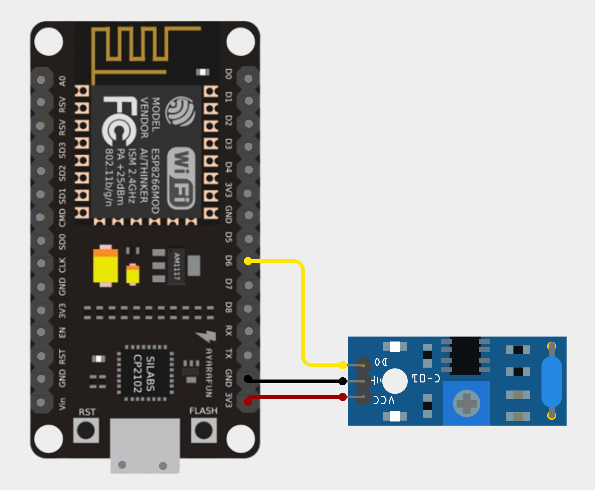
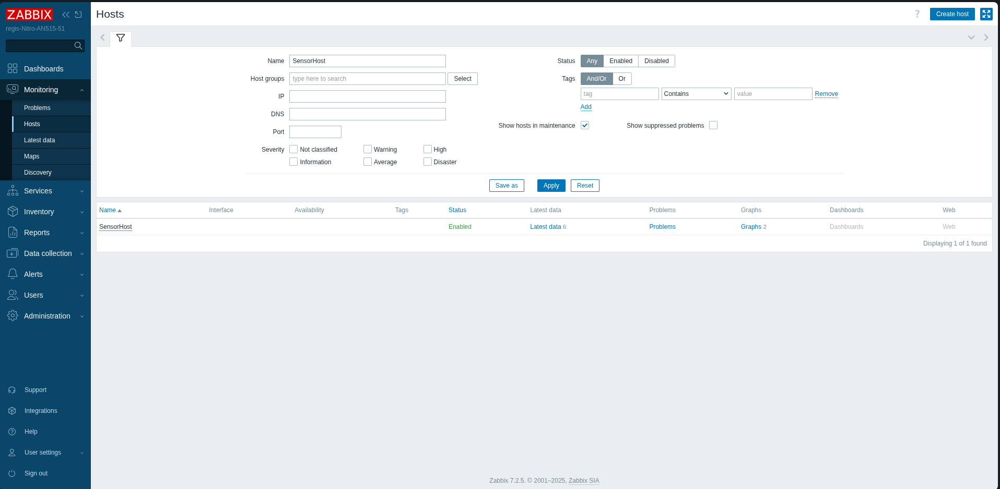
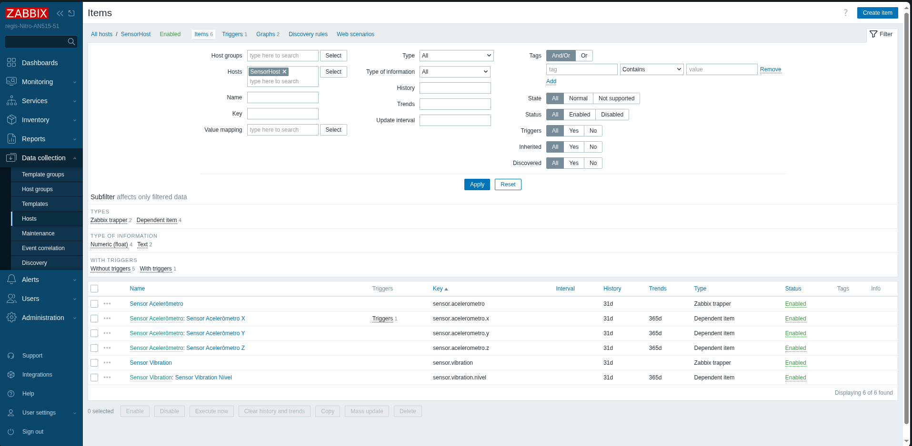
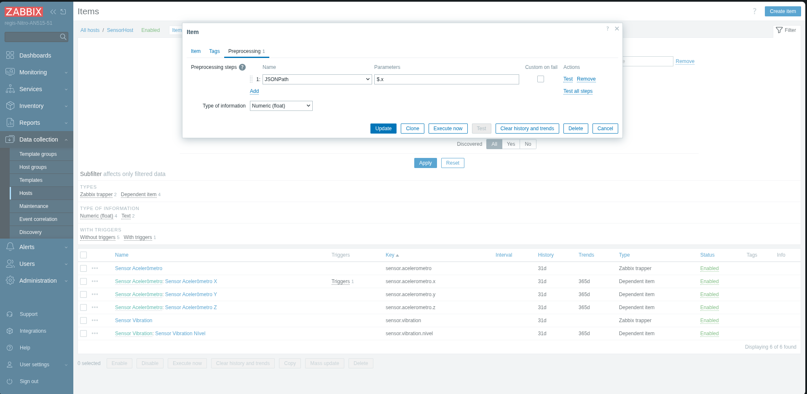
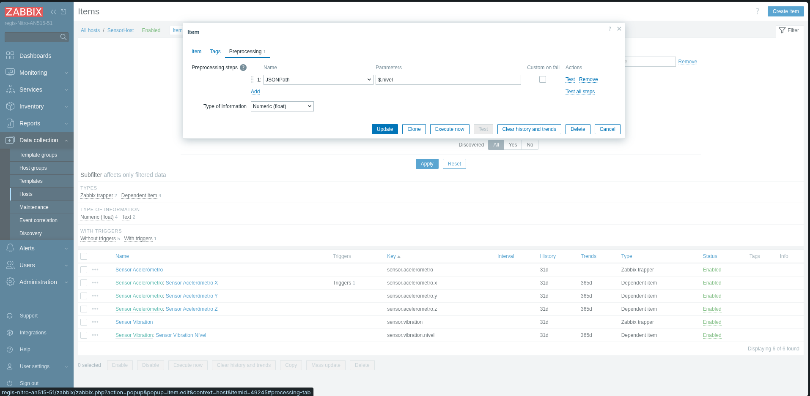

# Sistema de Monitoramento de Vibração para Detecção de Anomalias e Falhas em Máquinas na Indústria 4.0

## Visão Geral do Projeto

O Obiquos foi desenvolvido como um sistema de monitoramento IoT que coleta dados de dois diferentes sensores (acelerômetros e sensores de vibração) não simultaneamente. O sistema publica os dados via MQTT e os encaminha para o Zabbix para monitoramento e alertas, permitindo o monitoramento em tempo real das condições físicas do ambiente.

## Arquitetura

A arquitetura implementada consiste em três componentes principais:

1. **Nós Sensores**: Microcontroladores ESP8266 com sensores conectados  
2. **Broker MQTT**: Recebe e distribui dados dos sensores  
3. **Ponte MQTT-Zabbix**: Scripts Python que se inscrevem em tópicos MQTT e encaminham dados para o Zabbix  

<div align="center">


</div>

## Montagem do Hardware

### ESP32 com Sensor de Vibração SW-420



<!-- Espaço para inserir a imagem da ESP32 com o sensor SW-420 -->

### ESP32 com Sensor MPU6050


<!-- Espaço para inserir a imagem da ESP32 com o sensor MPU6050 -->

## Sensores Utilizados

* **MPU6050**: Acelerômetro e giroscópio de 3 eixos para detecção de movimentos
* **SW-420**: Sensor de vibração que fornece leituras digitais e analógicas

## Componentes de Hardware

Para a implementação deste projeto, foram utilizados:
* Placas de desenvolvimento ESP8266
* Módulos de sensor MPU6050
* Módulos de sensor de vibração SW-420
* Fontes de alimentação para as placas ESP
* Fios de conexão
* Computador rodando broker MQTT e servidor Zabbix

## Software Implementado

O projeto foi desenvolvido utilizando:
* Arduino IDE para a programação das placas ESP
* Bibliotecas para ESP:
  * `Wire.h`
  * `ESP8266WiFi.h` ou `WiFi.h`
  * `PubSubClient.h`
  * `Adafruit_MPU6050.h` e `Adafruit_Sensor.h` (ou `MPU6050.h`)
* Broker MQTT (Mosquitto)
* Python 3.x com as bibliotecas:
  * `paho-mqtt`
  * `json`
  * `subprocess`
* Servidor Zabbix configurado com hosts e itens específicos

## Implementação

### 1. Nós Sensores

Para os nós sensores, foram conectados:
* MPU6050: Pinos SDA, SCL, VCC e GND à placa ESP
* SW-420: Pinos DO (saída digital), AO (saída analógica), VCC e GND à placa ESP

As bibliotecas Arduino foram instaladas via Gerenciador de Bibliotecas:
* `PubSubClient`
* `Adafruit MPU6050`
* `Adafruit Unified Sensor`

Dois sketches diferentes foram desenvolvidos:
* `mqtt.ino` para o sensor MPU6050
* `mqtt_sw_420.ino` para o sensor SW-420

### 2. Broker MQTT

O Mosquitto foi instalado e configurado como broker MQTT usando:

```bash
sudo apt update
sudo apt install mosquitto mosquitto-clients
sudo systemctl enable mosquitto
```

### 3. Ponte MQTT-Zabbix

Foram desenvolvidos scripts Python que atuam como ponte entre o MQTT e o Zabbix:

```bash
sudo apt install python3 python3-pip zabbix-sender
pip3 install paho-mqtt
```

Dois scripts principais foram criados:
* mqtt2zabbix.py para dados do acelerômetro
* mqtt3zabbix.py para dados de vibração

### 4. Configuração do Zabbix

A instalação do Zabbix seguiu o tutorial disponível em:
[Tutorial de Instalação do Zabbix](https://github.com/miguelsrrobo/zabbix-install)

Para o monitoramento dos sensores, configurei:

1. Um host chamado **SensorHost**

   

2. **Configuração para o Acelerômetro**:
   * Um item master do tipo *trapper* chamado "Sensor Acelerômetro" com chave `sensor.acelerometro`
   * Três itens dependentes:
     * "Sensor Acelerômetro: Sensor Acelerômetro X" (chave: `sensor.acelerometro.x`)
     * "Sensor Acelerômetro: Sensor Acelerômetro Y" (chave: `sensor.acelerometro.y`)
     * "Sensor Acelerômetro: Sensor Acelerômetro Z" (chave: `sensor.acelerometro.z`)
   * O pré-processamento de cada item dependente foi configurado usando JSONPath:
     * Para o eixo X: `$.x`
     * Para o eixo Y: `$.y`
     * Para o eixo Z: `$.z`
   
   
   

3. **Configuração para o Sensor de Vibração**:
   * Um item master do tipo *trapper* chamado "Sensor Vibration" com chave `sensor.vibration`
   * Um item dependente:
     * "Sensor Vibration Nível" (chave: `sensor.vibration.nivel`)
   * O pré-processamento foi configurado usando JSONPath:
     * Para o nível: `$.nivel`
   
   

### 5. Integração com Grafana

Para melhorar a visualização dos dados, integrei o Zabbix com o Grafana seguindo o tutorial:
[Tutorial Grafana-Zabbix](https://github.com/RegisBloemer/Grafana-Zabbix-Tutorial)

## Parâmetros de Configuração

### Configuração das placas ESP8266

Os sketches Arduino foram configurados com:

```cpp
// Credenciais WiFi
const char* ssid     = "SEU_SSID_WIFI";
const char* password = "SUA_SENHA_WIFI";

// Broker MQTT
const char* mqtt_server = "IP_DO_SEU_BROKER_MQTT";
const int   mqtt_port   = 1883;
```

### Configuração dos Scripts Python

Os scripts de ponte foram configurados com:

```python
# Configurações MQTT
MQTT_BROKER = "IP_DO_SEU_BROKER_MQTT"
MQTT_PORT   = 1883
MQTT_TOPIC  = "sensor/acelerometro"  # ou "sensor/vibracao"

# Configurações Zabbix
ZABBIX_SERVER = "SEU_SERVIDOR_ZABBIX"
ZABBIX_PORT   = 10051
HOSTNAME      = "SensorHost"
```

## Funcionamento do Sistema

O sistema funciona com as placas ESP conectadas ao WiFi enviando dados para o broker MQTT. Os scripts Python se inscrevem nos tópicos relevantes e encaminham os dados para o Zabbix usando o comando `zabbix_sender`. Os dados são então processados e visualizados no dashboard do Zabbix ou Grafana.

### Formato dos Dados Transmitidos

#### Acelerômetro (MPU6050)

```json
{
  "x": 0.12,
  "y": -0.03,
  "z": 1.02,
  "gyro_x": 0.01,
  "gyro_y": 0.02,
  "gyro_z": -0.01,
  "temp": 24.5
}
```

#### Vibração (SW-420)

```json
{
  "vib": 1,
  "nivel": 845
}
```

## Resolução de Problemas Encontrados

Durante o desenvolvimento, diversos problemas foram solucionados:

### Problemas com ESP8266
* Problemas de conexão WiFi foram resolvidos verificando SSID e senha
* Problemas de conexão MQTT foram solucionados verificando IP e porta do broker
* Sensores não detectados foram resolvidos verificando fiação e endereços I2C

### Problemas com MQTT
* A verificação de publicação de dados foi feita usando:
  ```bash
  mosquitto_sub -t "sensor/acelerometro" -v
  mosquitto_sub -t "sensor/vibracao"   -v
  ```

### Problemas com Zabbix
* Problemas de recebimento de dados no Zabbix foram testados manualmente:
  ```bash
  zabbix_sender -z SEU_SERVIDOR_ZABBIX -p 10051 \
              -s "SensorHost" \
              -k sensor.acelerometro \
              -o '{"x":0,"y":0,"z":0}'
  ```
