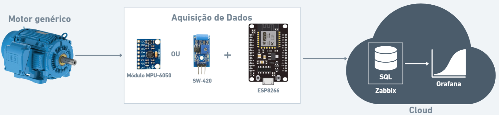
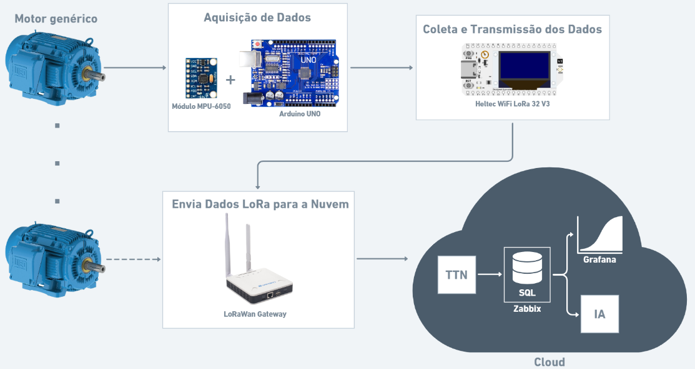

# Sistema de Monitoramento de Vibração para Detecção de Anomalias e Falhas em Máquinas na Indústria 4.0

## 1. Introdução

O avanço da Indústria 4.0 tem impulsionado a integração de tecnologias inteligentes em ambientes industriais, especialmente no que diz respeito ao monitoramento e à manutenção preditiva de máquinas. Falhas inesperadas em equipamentos podem gerar altos custos operacionais, comprometer a segurança e interromper a produção. Nesse contexto, sistemas de detecção precoce de anomalias tornam-se essenciais para garantir a eficiência e a continuidade dos processos.

Este projeto tem como objetivo desenvolver uma solução de monitoramento de vibração utilizando sensores embarcados e comunicação sem fio, com foco na detecção de anomalias e falhas em máquinas industriais. A proposta é explorar diferentes abordagens de conectividade e envio de dados, adaptando-se aos desafios enfrentados em ambientes reais da Indústria 4.0.

## 2. Motivação

Este projeto surge da busca por soluções acessíveis, eficazes e adaptáveis para o monitoramento de equipamentos industriais. Muitas pequenas e médias indústrias ainda enfrentam dificuldades para implementar sistemas de manutenção inteligente, seja por limitações técnicas, financeiras ou estruturais.

Ao explorar tecnologias como ESP8266, Arduino, módulos como o MPU-6050 e a comunicação LoRa, o projeto busca demonstrar que é possível construir sistemas eficientes com baixo custo, ampliando a acessibilidade dessas soluções. A relevância do tema está na prevenção de falhas, na redução de paradas não planejadas e na otimização da manutenção, com impactos diretos sobre a produtividade e a segurança.

Além disso, o desenvolvimento de soluções com foco em IoT industrial pode gerar benefícios sociais e econômicos ao contribuir com a modernização de processos, o aumento da eficiência energética e a redução de desperdícios. Também promove o aprendizado prático em tecnologias embarcadas e sistemas distribuídos, fundamentais para a formação de engenheiros na era da indústria digital.

## Visão Geral do Projeto

O projeto **"Sistema de Monitoramento de Vibração e Detecção de Anomalias na Indústria 4.0"**, desenvolvido como trabalho final para a disciplina de **Projeto de Sistemas Ubíquos e Embarcados** do curso de **Engenharia de Computação da UFSC**, tem como objetivo implementar uma solução inteligente de monitoramento para detecção de falhas em máquinas industriais.

O sistema foi estruturado em **dois cenários distintos**, com o propósito de investigar a melhor abordagem, considerando aspectos específicos dos desenvolvedores.

### Cenário 1 - ESP8266 com sensores

No **primeiro cenário**, foram realizados testes com um **ESP8266** conectado ao módulo **MPU-6050** (acelerômetro) e ao sensor **SW-420** (sensor de vibração), de forma que cada sensor foi utilizado separadamente para coleta de dados. Os dados coletados são transmitidos via **MQTT** e enviados para o **Zabbix**, permitindo o monitoramento remoto e a geração de alertas em tempo real. Os dados recebidos pelo **Zabbix** são então visualizados no **Grafana**, proporcionando uma interface gráfica para análise e monitoramento das condições dos sensores em tempo real.

#### Diagrama da Arquitetura

### Cenário 2 - Arduino UNO, Heltec WiFi LoRa 32 (V3) e Dragino LPS8N

No **segundo cenário**, um módulo **Heltec WiFi LoRa 32 (V3)** é utilizado para coletar e transmitir os dados adquiridos por um **Arduino UNO** conectado a um sensor **MPU-6050**, responsável por medir a vibração do motor. O **Arduino** realiza a leitura dos dados do sensor e os envia ao módulo **Heltec**, que transmite essas informações via **LoRa** ao **LoRaWAN Gateway (Dragino LPS8N)**.

Os dados são então enviados, por meio do **LoRaWAN Gateway**, para a plataforma **The Things Stack Sandbox**, onde serão processados e enviados para o **ThingSpeak**, onde serão visualizados em tempo real.

#### Diagrama da Arquitetura

# Divisões do Git

O repositório deste projeto está organizado de forma a facilitar a navegação e a compreensão das implementações realizadas. Cada pasta contém informações específicas sobre os cenários desenvolvidos, os códigos utilizados, as imagens incluídas no relatório, as descrições dos hardwares empregados e referências bibliográficas de exemplo, conforme descrito a seguir:

- A pasta [cenarios](./cenarios) contém os arquivos de cada cenário, incluindo detalhes sobre a implementação e os requisitos adotados;
- As pastas [codigos-cenario-I](./codigos-cenario-I) e [codigos-cenario-II](./codigos-cenario-II) armazenam os scripts utilizados em cada um dos cenários desenvolvidos, além de breves explicações;
- A pasta [imagens](./images) reúne as imagens empregadas nas descrições dos cenários;
- A pasta [hardwares](./hardwares) contêm as descrições dos hardwares utilizados no projeto;
- O arquivo [artigos-literatura.md](./artigos-literatura.md) reúne três referências bibliográficas utilizadas como exemplo durante o desenvolvimento do projeto. Como as ideias do projeto já estavam bem consolidadas desde o início da disciplina, não foram utilizados artigos científicos específicos, mas sim referências que serviram de base para a compreensão dos conceitos e tecnologias aplicadas;
- O PDF [manual-dragino](./manual-dragino.pdf) é um manual desenvolvido durante este projeto para a configuração do **LoRaWAN Gateway Dragino LPS8N**, utilizado no segundo cenário do projeto;
- O arquivo [README.md](./README.md) apresenta uma visão geral do projeto, incluindo a introdução, motivação e visão geral dos cenários.
