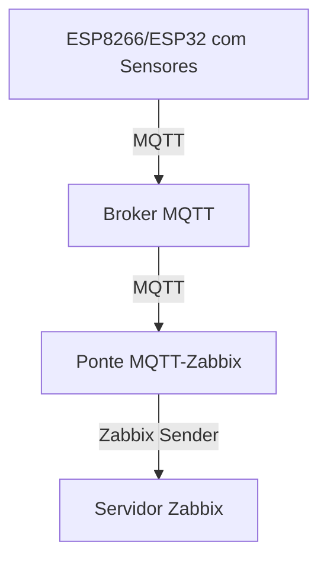

# Obiquos - Sistema de Monitoramento de Sensores

## Visão Geral do Projeto

É um sistema de monitoramento IoT que coleta dados de vários sensores (acelerômetros e sensores de vibração), publica-os via MQTT e os encaminha para o Zabbix para monitoramento e alertas. O sistema permite o monitoramento em tempo real das condições físicas do seu ambiente.

## Arquitetura

O sistema consiste em três componentes principais:

1. **Nós Sensores**: Microcontroladores ESP8266/ESP32 com sensores conectados  
2. **Broker MQTT**: Recebe e distribui dados dos sensores  
3. **Ponte MQTT-Zabbix**: Scripts Python que se inscrevem em tópicos MQTT e encaminham dados para o Zabbix  





## Montagem do Hardware

### ESP32 com Sensor de Vibração SW-420


<!-- Espaço para inserir a imagem da ESP32 com o sensor SW-420 -->

### ESP32 com Sensor MPU6050


<!-- Espaço para inserir a imagem da ESP32 com o sensor MPU6050 -->

## Sensores Suportados

* **MPU6050**: Acelerômetro e giroscópio de 3 eixos
* **SW-420**: Sensor de vibração (leituras digitais e analógicas)

## Requisitos de Hardware

* Placas de desenvolvimento ESP8266 ou ESP32
* Módulos de sensor MPU6050
* Módulos de sensor de vibração SW-420
* Fontes de alimentação para as placas ESP
* Fios de conexão
* Computador executando broker MQTT e servidor Zabbix

## Requisitos de Software

* Arduino IDE (para programar as placas ESP)
* Bibliotecas para ESP:

  * `Wire.h`
  * `ESP8266WiFi.h` ou `WiFi.h`
  * `PubSubClient.h`
  * `Adafruit_MPU6050.h` e `Adafruit_Sensor.h` (ou `MPU6050.h`)
* Broker MQTT (ex.: Mosquitto)
* Python 3.x
* Bibliotecas Python:

  * `paho-mqtt`
  * `json`
  * `subprocess`
* Servidor Zabbix com hosts e itens configurados adequadamente

## Instalação

### 1. Configurando os Nós Sensores

1. Conecte os sensores à sua placa ESP:

   * Para MPU6050: Conecte os pinos SDA, SCL, VCC e GND
   * Para SW-420: Conecte os pinos DO (saída digital), AO (saída analógica), VCC e GND
2. Instale as bibliotecas Arduino necessárias via Gerenciador de Bibliotecas:

   * `PubSubClient`
   * `Adafruit MPU6050`
   * `Adafruit Unified Sensor`
3. Carregue o sketch apropriado para sua placa ESP:

   * `mqtt.ino` (MPU6050)
   * `mqtt_sw_420.ino` (SW-420)

### 2. Configurando o Broker MQTT

```bash
sudo apt update
sudo apt install mosquitto mosquitto-clients
sudo systemctl enable mosquitto
```

### 3. Configurando a Ponte MQTT-Zabbix

```bash
sudo apt install python3 python3-pip zabbix-sender
pip3 install paho-mqtt
```

1. Copie os scripts da ponte para o servidor:

   * `mqtt2zabbix.py` (acelerômetro)
   * `mqtt3zabbix.py` (vibração)
2. Torne os scripts executáveis:

   ```bash
   chmod +x mqtt2zabbix.py mqtt3zabbix.py
   ```

### 4. Configurando o Zabbix

1. Para instalar o servidor Zabbix, siga o tutorial:
   [Tutorial de Instalação do Zabbix](https://github.com/miguelsrrobo/zabbix-install)
2. Crie um host chamado **SensorHost**.
3. Adicione itens do tipo *trapper* com chaves:

   * `sensor.acelerometro`
   * `sensor.vibration`
4. Configure gráficos e gatilhos conforme suas necessidades.

### 5. Integrando Zabbix com Grafana

Para uma melhor visualização, integre Zabbix e Grafana:
[Tutorial Grafana-Zabbix](https://github.com/RegisBloemer/Grafana-Zabbix-Tutorial)

## Configuração

### ESP8266/ESP32 (Arduino)

```cpp
// Credenciais WiFi
const char* ssid     = "SEU_SSID_WIFI";
const char* password = "SUA_SENHA_WIFI";

// Broker MQTT
const char* mqtt_server = "IP_DO_SEU_BROKER_MQTT";
const int   mqtt_port   = 1883;
```

### Ponte MQTT-Zabbix (Python)

```python
# Configurações MQTT
MQTT_BROKER = "IP_DO_SEU_BROKER_MQTT"
MQTT_PORT   = 1883
MQTT_TOPIC  = "sensor/acelerometro"  # ou "sensor/vibracao"

# Configurações Zabbix
ZABBIX_SERVER = "SEU_SERVIDOR_ZABBIX"
ZABBIX_PORT   = 10051
HOSTNAME      = "SensorHost"
```

## Utilização

1. Ligue as placas ESP e conecte ao WiFi.
2. Inicie os scripts da ponte:

   ```bash
   python3 mqtt2zabbix.py &
   python3 mqtt3zabbix.py &
   ```
3. Monitore os dados no Zabbix.

### Formato dos Dados

#### Acelerômetro (MPU6050)

```json
{
  "x": 0.12,
  "y": -0.03,
  "z": 1.02,
  "gyro_x": 0.01,
  "gyro_y": 0.02,
  "gyro_z": -0.01,
  "temp": 24.5
}
```

#### Vibração (SW-420)

```json
{
  "vib": 1,
  "nivel": 845
}
```

## Solução de Problemas

### ESP8266/ESP32

* **Falha na Conexão WiFi**: Verifique SSID e senha.
* **Falha na Conexão MQTT**: Verifique IP e porta do broker.
* **Sensor Não Detectado**: Confira fiação e endereços I2C.

### MQTT

* **Nenhum Dado Publicado**:

  ```bash
  mosquitto_sub -t "sensor/acelerometro" -v
  mosquitto_sub -t "sensor/vibracao"   -v
  ```

### Zabbix

* **Sem Dados no Zabbix**:

  ```bash
  zabbix_sender -z SEU_SERVIDOR_ZABBIX -p 10051 \
              -s "SensorHost" \
              -k sensor.acelerometro \
              -o '{"x":0,"y":0,"z":0}'
  ```

```
```
