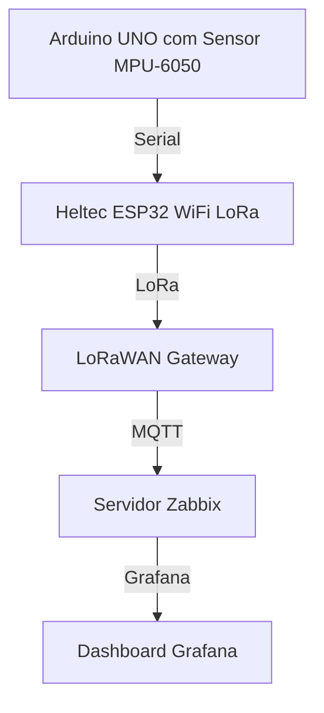

# Cenário 2 - Arduino UNO, Heltec WiFi LoRa 32 V3 e Dragino LPS8N

## Requisitos Funcionais 

- Estabelecer comunicação entre o Heltec ESP32 WiFi LoRa e o LoRaWAN Gateway para a transmissão de dados a longas distâncias
- Utilizar o Arduino UNO como base de alimentação, coleta e transmissão inicial dos dados do sensor
- Integrar os dados recebidos pelo LoRaWAN Gateway à plataforma Zabbix para monitoramento e armazenamento
- Visualizar os dados recebidos e processados no Grafana, com gráficos e dashboards em tempo real
- Aplicar algoritmos de IA na plataforma para detectar anomalias nos dados de vibração e fornecer alertas
  
## Requisitos Não Funcionais

- **Desempenho**: Garantir que a troca de mensagens entre os módulos ocorra de forma fluida e estável
- **Escalabilidade**: Permitir a adição de novos sensores ou módulos LoRa com poucas alterações no sistema
- **Manutenibilidade**: Manter o código modular e bem comentado para facilitar futuras modificações
- **Portabilidade**: Garantir compatibilidade com outras placas Arduino e módulos LoRa com pequenas adaptações

## Arquitetura

1. **Nó Sensor**: **Arduino UNO** conectado ao módulo **MPU-6050** para coletar dados de vibração  
2. **Heltec ESP32 WiFi LoRa**: Módulo responsável por transmitir os dados coletados pelo **Arduino UNO** via **LoRa**  
3. **LoRaWAN Gateway**: Recebe os dados transmitidos pelo **Heltec ESP32 WiFi LoRa** via **LoRa**  
4. **Plataforma Zabbix**: Armazena e monitora os dados recebidos do **LoRaWAN Gateway**  
5. **Grafana**: Visualiza os dados armazenados no **Zabbix**  

### Diagrama da Arquitetura

## Montagem do Hardware

## Sensores Utilizados

* **MPU-6050**: Acelerômetro e giroscópio de 3 eixos para detecção de movimentos

## Componentes de Hardware

Para a implementação deste cenário, foram utilizados:
* Arduino UNO
* Módulo MPU-6050
* Heltec WiFi LoRa 32 V3
* Dragino LPS8N
* Fonte de alimentação para o Arduino UNO
* Fios de conexão
* Computador de acordo com as necessidades do cenário (ainda em definição...)

**❗Atenção:** Este cenário sofreu alterações, por isso todas as informações ainda não foram colocadas aqui. 
