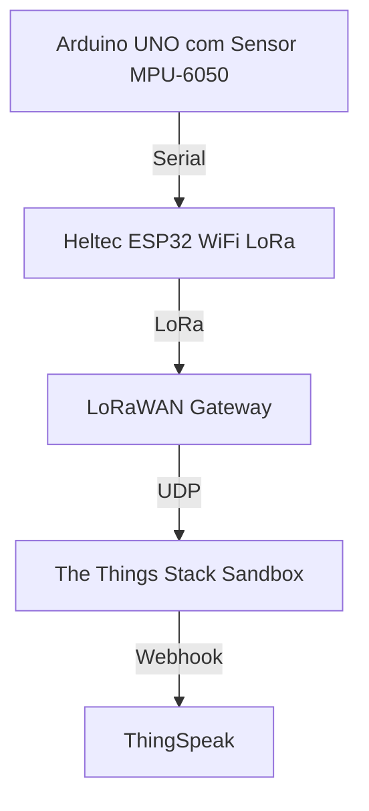
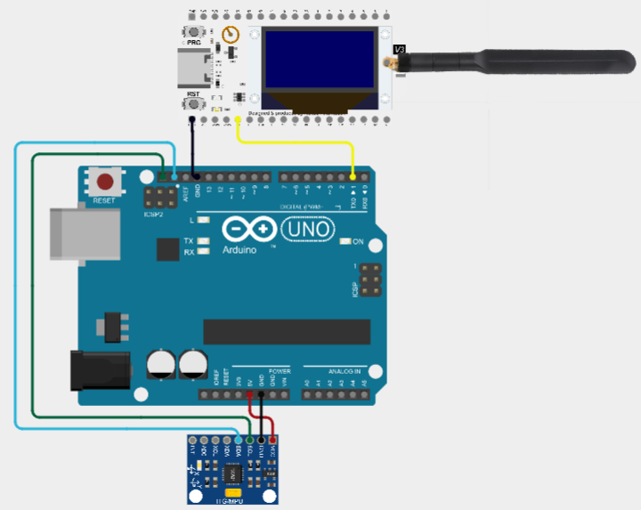
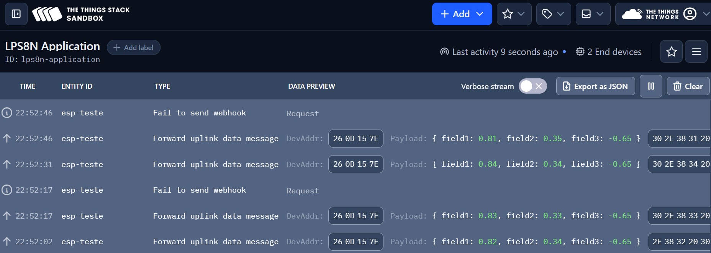
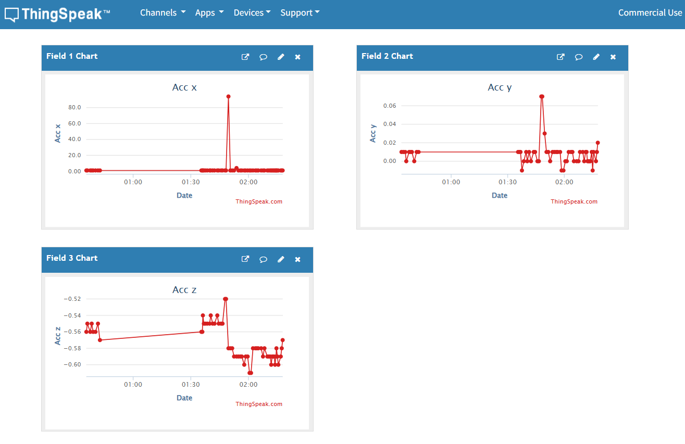

# Cenário 2 - Arduino UNO, Heltec WiFi LoRa 32 V3 e Dragino LPS8N

## Requisitos Funcionais 

- Estabelecer comunicação entre o Heltec ESP32 WiFi LoRa e o LoRaWAN Gateway para a transmissão de dados a longas distâncias
- Utilizar o Arduino UNO como base de alimentação, coleta e transmissão inicial dos dados do sensor
- Integrar os dados recebidos pelo LoRaWAN Gateway à plataforma Zabbix para monitoramento e armazenamento
- Visualizar os dados recebidos e processados no Grafana, com gráficos e dashboards em tempo real
  
## Requisitos Não Funcionais

- **Desempenho**: Garantir que a troca de mensagens entre os módulos ocorra de forma fluida e estável
- **Escalabilidade**: Permitir a adição de novos sensores ou módulos LoRa com poucas alterações no sistema
- **Manutenibilidade**: Manter o código modular e bem comentado para facilitar futuras modificações
- **Portabilidade**: Garantir compatibilidade com outras placas Arduino e módulos LoRa com pequenas adaptações

## Arquitetura

1. **Nó Sensor**: **Arduino UNO** conectado ao módulo **MPU-6050** para coletar dados de vibração  
2. **Heltec ESP32 WiFi LoRa**: Módulo responsável por transmitir os dados coletados pelo **Arduino UNO** via **LoRa**  
3. **LoRaWAN Gateway**: Recebe os dados transmitidos pelo **Heltec ESP32 WiFi LoRa** via **LoRa**  
4. **Plataforma The Things Stack Sandbox**: Recebe os dados do **LoRaWAN Gateway** e os encaminha para o **ThingSpeak** 
5. **ThingSpeak**: Armazena e possibilita visualizar os dados recebidos, permitindo a criação de dashboards e gráficos em tempo real

<div align="center">


</div>

### Diagrama da Arquitetura


## Montagem do Hardware




A montagem do hardware deve seguir o diagrama de conexão abaixo:

1. Conectar o MPU-6050 ao Arduino UNO:
   - VCC do MPU-6050 ao 5V do Arduino
   - GND do MPU-6050 ao GND do Arduino
   - SDA do MPU-6050 ao pino A4 do Arduino
   - SCL do MPU-6050 ao pino A5 do Arduino

2. Conectar o Heltec ESP32 WiFi LoRa ao Arduino UNO:
   - RX do Heltec ao TX do Arduino
   - TX do Heltec ao RX do Arduino (não utilizado neste cenário, pois o Arduino envia dados e o Heltec recebe)
   - GND do Heltec ao GND do Arduino (garante o mesmo nível de referência)
   - Fontes de alimentação separadas para o Arduino e o Heltec ESP32

3. Conectar o Dragino LPS8N ao Heltec ESP32:
   - Seguir as instruções do fabricante para a conexão correta

## Sensores Utilizados

* **MPU-6050**: Acelerômetro e giroscópio de 3 eixos para detecção de movimentos

## Componentes de Hardware

Para a implementação deste cenário, foram utilizados:
* Arduino UNO
* Módulo MPU-6050
* Heltec WiFi LoRa 32 (V3)
* Dragino LPS8N
* Fontes de alimentação para o Arduino e o Heltec ESP32
* Fios de conexão
* Computador com Arduino IDE para a programação
* Conexões USB para programação e alimentação

## Software Implementado

O cenário foi desenvolvido utilizando:
* Arduino IDE para a programação do Arduino UNO e do Heltec ESP32
* Bibliotecas para ESP32:
  * `Wire.h`
  * `Heltec ESP32 Dev-Boards` (incluir LoRaWan_APP.h)
* The Things Stack Sandbox para gerenciamento de dispositivos LoRaWAN
* ThingSpeak para visualização e análise dos dados

## Implementação

### 1. Nó Sensor

- O nó sensor é composto pelo Arduino UNO conectado ao módulo MPU-6050. 
- O Arduino coleta os dados do sensor e os envia via Serial para o Heltec ESP32 WiFi LoRa. 
- O Heltec ESP32 WiFi LoRa recebe os dados via UART e os transmite via LoRa para o LoRaWAN Gateway. 

As bibliotecas Arduino foram instaladas via Gerenciador de Bibliotecas:
* `Wire.h` para o Arduino UNO (comunicação I2C com o MPU-6050)
* `Heltec ESP32 Dev-Boards` para o Heltec ESP32 WiFi LoRa 32, incluindo a pilha LoRaWan_APP

### 2. Arduino UNO e MPU-6050

Foi utilizado um código baseado no exemplo de [Cleber Borges - FunBots](https://www.youtube.com/channel/UCKs2l5weIqgJQxiLj0A6Atw), adaptado para coletar os dados brutos do sensor MPU-6050. 

### 2.1 Endereço I2C do sensor MPU-6050

O endereço I2C padrão do MPU-6050 é `0x68`, utilizado quando o pino **AD0 está conectado ao GND**. Caso AD0 esteja em nível alto (ligado ao VCC), o endereço muda para `0x69`. Isso permite usar até dois sensores no mesmo barramento I2C.

```cpp
const int MPU = 0x68;
```

### 2.2 Configuração dos fundos de escala

O MPU-6050 permite configurar o fundo de escala do **acelerômetro** e do **giroscópio** por meio dos registradores `0x1C` e `0x1B`, respectivamente. Cada configuração define a **faixa máxima de medição** e a **sensibilidade (LSB/unidade física)**.

#### Acelerômetro – Registrador 0x1C (`ACCEL_CONFIG`)

| Fundo de escala | Bits | Sensibilidade (LSB/g) |
|------------------|------|------------------------|
| ±2g              | `0b00000000` | 16384 |
| ±4g              | `0b00001000` | 8192  |
| ±8g              | `0b00010000` | 4096  |
| ±16g             | `0b00011000` | 2048  |

```cpp
Wire.beginTransmission(MPU);
Wire.write(0x1C);              // Registrador ACCEL_CONFIG
Wire.write(0b00011000);        // Fundo de escala: ±16g
Wire.endTransmission();
```

#### Giroscópio – Registrador 0x1B (`GYRO_CONFIG`)

| Fundo de escala | Bits | Sensibilidade (LSB/°/s) |
|------------------|------|--------------------------|
| ±250°/s          | `0b00000000` | 131.0  |
| ±500°/s          | `0b00001000` | 65.5   |
| ±1000°/s         | `0b00010000` | 32.8   |
| ±2000°/s         | `0b00011000` | 16.4   |

```cpp
Wire.beginTransmission(MPU);
Wire.write(0x1B);              // Registrador GYRO_CONFIG
Wire.write(0b00011000);        // Fundo de escala: ±2000°/s
Wire.endTransmission();
```

### 2.3 Conversão dos dados

A conversão dos dados brutos é feita conforme o fundo de escala selecionado. No caso deste cenário, foi utilizado ±16g:

```cpp
Serial.print(AccX / 2048);
Serial.print(" ");
Serial.print(AccY / 2048);
Serial.print(" ");
Serial.println(AccZ / 2048);
```
## 3. **Heltec ESP32 WiFi LoRa**

Este código foi **adaptado do exemplo básico `LoRaWan`**, disponível na biblioteca **Heltec ESP32 Dev-Boards**, para permitir a recepção de dados de um Arduino via UART e envio para a rede LoRaWAN utilizando OTAA (Over-The-Air Activation).

---

### 3.1 Observação importante sobre drivers USB

O **Heltec WiFi LoRa 32 (V3)** utiliza o chip **CP2102** como conversor USB ↔ UART. Em muitos casos, a placa pode não ser reconhecida pelo computador caso os drivers adequados não estejam instalados.

#### Driver necessário:

- **CP2102**: [CP210x USB to UART Bridge Driver – Silicon Labs](https://www.silabs.com/developers/usb-to-uart-bridge-vcp-drivers)

---

### 3.2 Detalhes da implementação

- O código usa **UART1** do ESP32 (`HardwareSerial mySerial(1)`) para receber dados via `GPIO43`.
- A função `prepareTxFrame()` monta um payload com base no texto recebido via serial e o envia para a rede LoRaWAN.
- A transmissão é feita utilizando **OTAA**, com IDs definidos no início do código.
- Caso nenhum dado seja recebido pela UART, um fallback é enviado (`"0.00 0.00 0.00"`).

---

### 3.3 Trecho principal de leitura UART + envio LoRaWAN

```cpp
HardwareSerial mySerial(1); // UART1

void setup()
{
  Serial.begin(115200);                             // Debug USB
  mySerial.begin(115200, SERIAL_8N1, 43, -1);       // UART1 RX = GPIO43
  Mcu.begin(HELTEC_BOARD, SLOW_CLK_TPYE);           // Inicialização da placa Heltec
}

static void prepareTxFrame(uint8_t port)
{
  static char message[MAX_PAYLOAD_SIZE];
  static String serialData = "";

  while (mySerial.available()) {
    char c = mySerial.read();
    if (c == '\n') break;
    serialData += c;
  }

  if (serialData.length() > 0) {
    serialData.trim();
    snprintf(message, sizeof(message), "%s", serialData.c_str());

    appDataSize = strlen(message);
    for (int i = 0; i < appDataSize; i++) {
      appData[i] = (uint8_t)message[i];
    }

    serialData = "";
  } else {
    // Fallback
    const char* fallback = "0.00 0.00 0.00";
    appDataSize = strlen(fallback);
    for (int i = 0; i < appDataSize; i++) {
      appData[i] = (uint8_t)fallback[i];
    }
  }
}
```

---

### 3.4 Estado do dispositivo e envio periódico

O loop principal implementa uma **máquina de estados** conforme a biblioteca Heltec:

```cpp
switch (deviceState)
{
  case DEVICE_STATE_INIT:
    LoRaWAN.init(loraWanClass, loraWanRegion);
    break;

  case DEVICE_STATE_JOIN:
    LoRaWAN.join();
    break;

  case DEVICE_STATE_SEND:
    prepareTxFrame(appPort);
    LoRaWAN.send();
    deviceState = DEVICE_STATE_CYCLE;
    break;

  case DEVICE_STATE_CYCLE:
    txDutyCycleTime = appTxDutyCycle + randr(-APP_TX_DUTYCYCLE_RND, APP_TX_DUTYCYCLE_RND);
    LoRaWAN.cycle(txDutyCycleTime);
    deviceState = DEVICE_STATE_SLEEP;
    break;

  case DEVICE_STATE_SLEEP:
    LoRaWAN.sleep(loraWanClass);
    break;

  default:
    deviceState = DEVICE_STATE_INIT;
    break;
}
```

---

### 3.5 Configurações LoRaWAN utilizadas

- **OTAA** ativado
- **Device EUI**, **App EUI** e **App Key** definidos manualmente
- **Classe C**
- **Intervalo entre envios**: `15000 ms` (ajustável via `appTxDutyCycle`)
- **ADR** ativado (`loraWanAdr = true`)
- **Confirmação de envio** ativada (`isTxConfirmed = true`)

## 4. Configuração do LoRaWAN Gateway + The Things Network + end device

Para a configuração do **LoRaWAN Gateway Dragino LPS8N**, um PDF com passo a passo está disponível aqui no repositório: [manual-dragino.pdf](../manual-dragino.pdf).

## 4.1 Integração com ThingSpeak

A configuração do **ThingSpeak** deve ser feita conforme as instruções disponíveis na documentação oficial da TTN: [ThingSpeak](https://www.thethingsindustries.com/docs/integrations/cloud-integrations/thingspeak/).

Vale lembrar que, para os dados serem enviados corretamente para o ThingSpeak, é necessário configurar o **payload formatter** na TTN para decodificar os dados recebidos do Heltec ESP32. O payload formatter deve ser configurado para interpretar os dados do MPU-6050, que são enviados como uma string no formato `"AccX AccY AccZ"`.

```js
function decodeUplink(input) {
  var msg = String.fromCharCode.apply(null, input.bytes);
  var partes = msg.trim().split(" ");
  return {
    data: {
      field1: parseFloat(partes[0]),
      field2: parseFloat(partes[1]),
      field3: parseFloat(partes[2])
    },
    warnings: [],
    errors: []
  };
}
```
## 5. Live data no The Things Stack Sandbox e ThingSpeak




