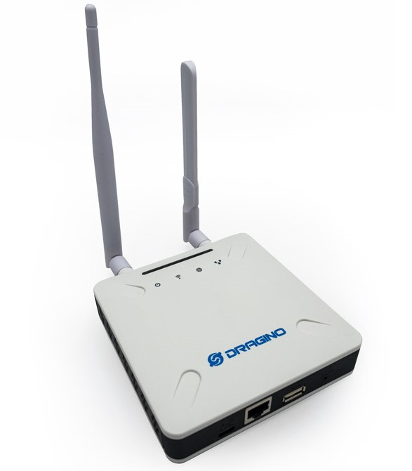

# LoRaWAN Gateway Dragino LPS8N

O Dragino LPS8N é um gateway LoRaWAN de interior baseado no chip SX1302. Ele permite a recepção e transmissão de pacotes LoRa em redes LoRaWAN públicas ou privadas.

## Imagem

## Características e Especificações

| Parâmetro                          | Descrição                                                                  |
|-----------------------------------|----------------------------------------------------------------------------|
| **Chip LoRa**                     | 1 x SX1302 + 2 x SX1250 (transceptores LoRa)                              |
| **Porta Ethernet**                | 1 x RJ45 (10M/100M)                                                        |
| **Conectividade Wi-Fi**          | 2.4 GHz Wi-Fi (802.11 b/g/n)                                               |
| **Porta USB Host**               | 1 x USB-A                                                                  |
| **Alimentação**                   | Via USB Type-C – 5V, 2A                                                    |
| **Versão com 4G (opcional)**      | Suporte a módulo 4G opcional                                              |
| **Função principal**              | Gateway LoRaWAN para transmissão de dados via rede local ou Internet      |
| **Aplicações comuns**            | Redes LoRaWAN indoor, monitoramento remoto, integração com plataformas IoT |

