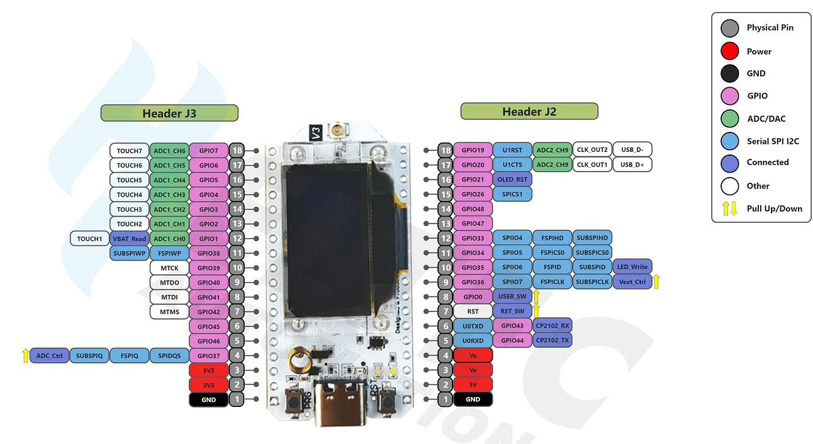

# Heltec WiFi LoRa 32 (V3) - ESP32 com OLED

A placa Heltec WiFi LoRa 32 (V3) combina conectividade Wi-Fi, Bluetooth e LoRa em um único módulo compacto com display OLED integrado, sendo ideal para projetos de IoT com comunicação de longo alcance e baixo consumo.

## Imagem do Pinout

## Especificações e características

| Parâmetro                      | Descrição                                                                 |
|-------------------------------|---------------------------------------------------------------------------|
| **Chip Principal**            | ESP32-S3FN8 (Processador dual-core Xtensa® 32-bit LX7)                    |
| **Chip LoRa**                 | SX1262                                                                    |
| **Chip USB-Serial**           | CP2102                                                                    |
| **Frequência**                | 470 ~ 510 MHz, 863 ~ 928 MHz                                                  |
| **Potência Máxima de TX**     | 21±1 dBm                                                                  |
| **Sensibilidade Máxima de RX**| -134 dBm @ SF12 BW = 125 kHz                                                |
| **Wi-Fi**                     | 802.11 b/g/n (até 150 Mbps)                                               |
| **Bluetooth**                 | Bluetooth 5 (Low Energy)                                                  |
| **Recursos de Hardware**      | 7 × ADC1 + 2 × ADC2; 7 × Touch; 3 × UART; 2 × I2C; 2 × SPI; etc.                |
| **Memória**                   | 384 KB ROM; 512 KB SRAM; 16 KB RTC SRAM; 8 MB Flash (SiP)                 |
| **Interfaces**                | USB Tipo-C; 2 × conector 1,25 mm p/ bateria; ANT LoRa (IPEX 1.0); Header 2 × 18 pinos 2,54 mm |
| **Bateria**                   | Suporte a alimentação e carregamento com bateria de lítio 3,7 V           |
| **Temperatura de Operação**  | -20 ~ 70 ℃                                                                |
| **Dimensões**                 | 50,2 × 25,5 × 10,2 mm                                                     |

Para mais informações, acesse: [https://heltec.org/project/wifi-lora-32-v3/](https://heltec.org/project/wifi-lora-32-v3/).
