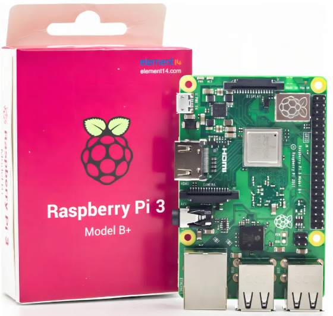

# Raspberry Pi 3 Model B+

O Raspberry Pi 3 Model B+ é um microcomputador de placa única (SBC) de 64 bits, desenvolvido para aplicações educacionais, embarcadas e de IoT. Ele oferece conectividade sem fio aprimorada, suporte a PoE (Power over Ethernet) e maior desempenho em relação às versões anteriores.

## Imagem

## Características e Especificações

| Parâmetro                        | Descrição                                                                                       |
|----------------------------------|-------------------------------------------------------------------------------------------------|
| **Processador (SoC)**            | Broadcom BCM2837B0, quad-core ARM Cortex‑A53 64-bit @ 1.4 GHz                                   |
| **Memória RAM**                  | 1 GB LPDDR2                                                                                     |
| **Conectividade sem fio**        | Wi-Fi dual-band 2.4 GHz e 5 GHz (IEEE 802.11 b/g/n/ac), Bluetooth 4.2 / BLE                    |
| **Ethernet**                     | Gigabit Ethernet via USB 2.0 (até 300 Mbps de throughput)                                       |
| **Portas USB**                   | 4 × USB 2.0                                                                                     |
| **Saída de vídeo e áudio**       | 1 × HDMI full-size, saída de áudio estéreo + vídeo composto via conector de 4 polos            |
| **Portas auxiliares**            | 1 × MIPI DSI (display), 1 × MIPI CSI (câmera)                                                  |
| **Multimídia**                   | Suporte a H.264 e MPEG-4 (decodificação até 1080p30), codificação H.264 (1080p30), OpenGL ES 1.1/2.0 |
| **Armazenamento**                | Slot microSD (sistema operacional e dados)                                                     |
| **GPIO**                         | 40 pinos GPIO (compatível com HATs)                                                            |
| **Alimentação**                  | 5 V via micro USB (2,5 A) ou via pinos GPIO; suporte a PoE com PoE HAT opcional               |
| **Temperatura operacional**      | 0 °C a 50 °C                                                                                    |
| **Dimensões físicas**            | 85,6 × 56,5 mm                                                                                  |
| **Peso**                         | Aproximadamente 45 g                                                                            |
| **Tempo médio entre falhas (MTBF)** | 378.000 horas em ambiente controlado                                                           |

Fonte: [Raspberry Pi 3 Model B+ Product Brief (2025)](https://www.raspberrypi.com/products/raspberry-pi-3-model-b/) – Raspberry Pi Ltd.
