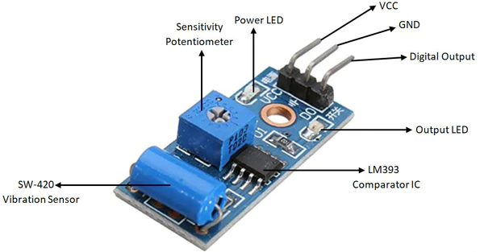

# Sensor SW-420

O sensor SW-420 é um módulo de detecção de vibração, ideal para projetos de monitoramento e detecção de falhas em sistemas industriais. Ele utiliza um interruptor de tipo fechado e possui um potenciômetro interno para calibração da sensibilidade.

## Imagem do Pinout

## Características e Especificações

- **Tensão de operação**: 3,3 Volts – 5,0 Volts DC
- **Capacidade de corrente**: 15 mA
- **Dimensões do módulo do sensor**: 3,2 cm x 1,4 cm
- **Tipo de interruptor**: Fechado por padrão
- **Potenciômetro interno de 10 K** para calibração da sensibilidade do sensor
- **Chip comparador LM393 de baixa potência** para binarizar o sinal analógico, com capacidade de condução de 15 mA
- **LEDs indicadores** de status de alimentação e saída
- **Fixação com parafuso** para fácil instalação
- **Compatível com microcontroladores**, podendo ser conectado a qualquer um deles
